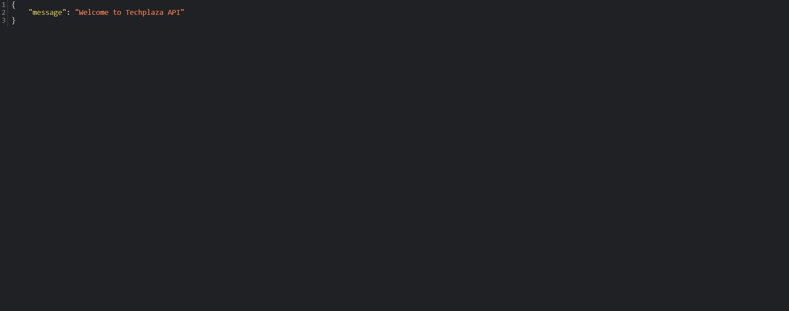
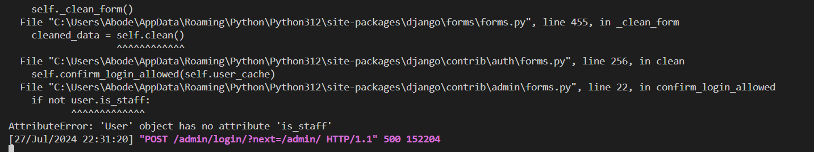
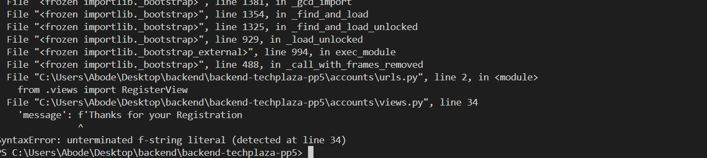
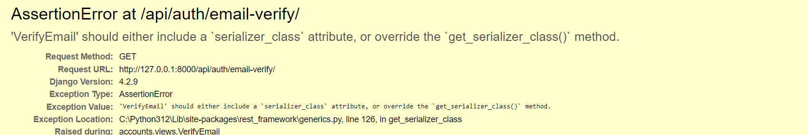
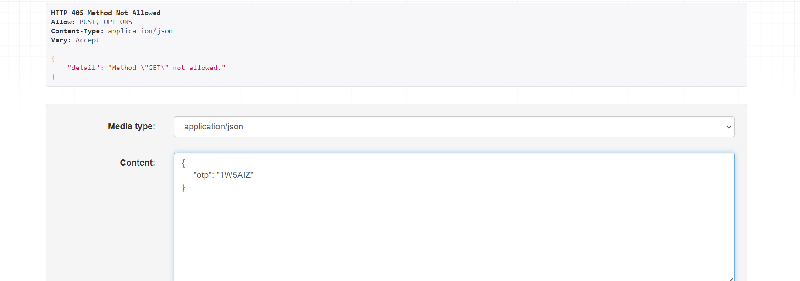
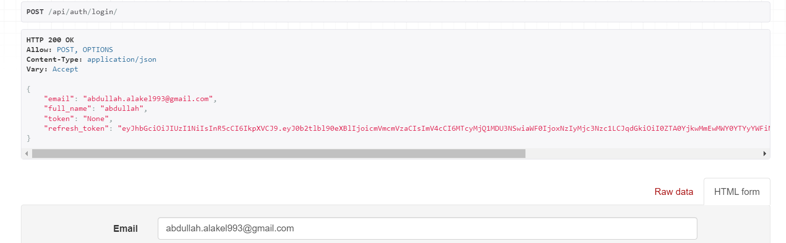
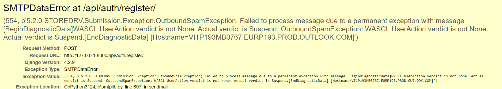

<h1 align="center">TECHPLAZA - API</h1>

**TECHPLAZA-API** The robust backend infrastructure is meticulously crafted to support the diverse functionalities of the Techplaza platform. Powered by the Django Rest Framework (DRF), the backend ensures seamless integration with the ReactJS frontend. Users can register, log in, and access various applications, including weather updates, task management, community Cards, games, and more.



* This section of the project comprises the backend API database, designed to support the React.js frontend, and is powered by the Django Rest Framework.

#### - BACKEND LIVE LINK: [HEROKU - TECHPLAZA API](https://backend-techplaza-1b0c24eaa252.herokuapp.com/)

#### - FRONTEND LIVE LINK: [HEROKU - TECHPLAZA SITE](https://frontend-techplaza-d0af91d53972.herokuapp.com/)

#### - FRONTEND REPOSITORY: [GITHUB - FRONTEND REPO](https://github.com/alakeldev/techplaza-app-frontend)

# Contents

* [**User Stories**](<#user-stories>)
* [**Database Schema**](<#database-schema>)
* [**Testing**](<#testing>)
  * [**Validator Tests**](<#validator-tests>)
  * [**Manual Tests**](<#manual-tests>)
  * [**Fixed Bugs**](<#fixed-bugs>)
  * [**Unfixed Bugs**](<#unfixed-bugs>)
* [**Technologies Used**](<#technologies-used>)
  * [**Languages**](<#languages>)
  * [**Frameworks**](<#frameworks>)
  * [**Software**](<#software>)
  * [**Libraries and Imports**](<#libraries-and-imports>)
* [**Deployment**](<#deployment>)
* [**Credits**](<#credits>)
  * [**Content**](<#content>)

# User Stories

Not all stories have been implemented. Some have been left for future implementations as the Techplaza platform grows and expands.

* Admin:
  * As an admin, I can an easy-to-navigate panel to manage the registered users and delete the not verified  ones.

* Visitors and Registered Users:
  * As a website user (Registered / Not Registered), I want to access the home page so that I can understand what the platform offers.
  * As a website user (Registered / Not Registered), I want to access the about page so that I can learn more about the platform.
  * As a website user (Registered / Not Registered), I want to access the services page so that I can see what services are offered.
  * As a website user (Registered / Not Registered), I want to access the contact page so that I can contact the admin of the platform to get support or provide feedback.

* Visitors:
  * As a visitor, I want to register an account so that I can access the platform’s features.
  * As a visitor, I want to verify my email after registration so that I can activate my account and be as Registered User.

* Registered Users:
  * As a registered user, I want to log in to the platform after verified my registration so that I can access my Dashboard.
  * As a registered user, I want to reset my password if I forget it so that I can regain access to my account.
  * As a registered user, I want to be notified if I enter an unregistered email in the password reset process so that I know to correct the email or register with it first.
  * As a registered user, I want to access my dashboard so that I can manage my account and access the applications.
  * As a logged in user, I want to edit my name on the dashboard so that I can update my information.
  * As a registered user, I want to delete my account so that I can leave the community.
  * As a registered user, I want to log out of the platform so that I can secure my account.
  * As a registered user, I want to easy access all community applications, also to navigate back to the dashboard from any application so that I can manage my account.
  * As a registered user, I want to access the weather application from the dashboard so that I can check the weather.
  * As a registered user, I want to enter a city or country name to get weather information so that I can plan my activities.
  * As a registered user, I want to access the tasks manager application from the dashboard so that I can manage my tasks.
  * As a registered user, I want to create a new task with a title and description so that I can manage my to-do list.
  * As a registered user, I want to edit my tasks so that I can update their information.
  * As a registered user, I want to mark tasks as done or undone so that I can track my progress.
  * As a registered user, I want to delete my tasks so that I can remove completed or unnecessary tasks.
  * As a registered user, I want to access the snake game application from the dashboard so that I can play the game.
  * As a registered user, I want to play the snake game and know which keyboard controls must use so that I can have fun.
  * As a registered user, I want to see the MVP and best score players in the community so that I can compete with others.
  * As a registered user accessing the platform on a small or medium screen, I want to be informed about why the game is not displaying and be provided with an option to navigate back to the dashboard.
  * As a registered user, I want to access the card community application from the dashboard so that I can create, display my card and view the other community members cards.
  * As a registered user, I want to filter the cards by specific country so that I can find cards relevant to my residence country or specific country.
  * As a registered user, I want to create a card with my name, email, number, profession, description, and country so that I can share my information with the community.
  * As a registered user, I want to edit and delete my card so that I can update or remove my information.

The closed Techplaza platform GitHub issues can be found here - [Techplaza GitHub Closed Issues](https://github.com/alakeldev/techplaza-app-frontend/issues?q=is%3Aissue+is%3Aclosed)

The Techplaza Project Board can be found here - [Techplaza Project Board](https://github.com/users/alakeldev/projects/7)

# Database Schema


# Testing

The Techplaza platform project has been tested rigorously throughout the development process. This section will provide details on the tests carried out specifically on the backend API.

## Validator Tests

| **TEST** | **ACTION** | **EXPECTATION** | **RESULT** |
| ----------------------------- | ----------------------- | --------------------------- | ---------- |
| manage.py | [PEP8 - CI](https://pep8ci.herokuapp.com/) | [No issues found](static/readme/manage_py_file.png) | ✅ |
| techplaza_api project - urls.py | [PEP8 - CI](https://pep8ci.herokuapp.com/) | [No issues found](static/readme/techplaza_api_urls.png) | ✅ |
| techplaza_api project - views.py | [PEP8 - CI](https://pep8ci.herokuapp.com/) | [No issues found](static/readme/techplaza_api_views.png) | ✅ |
| accounts app - admin.py | [PEP8 - CI](https://pep8ci.herokuapp.com/) | [No issues found](static/readme/accounts_admin.png) | ✅ |
| accounts app - managers.py | [PEP8 - CI](https://pep8ci.herokuapp.com/) | [No issues found](static/readme/accounts_managers.png) | ✅ |
| accounts app - models.py | [PEP8 - CI](https://pep8ci.herokuapp.com/) | [No issues found](static/readme/accounts_models.png) | ✅ |
| accounts app - serializers.py | [PEP8 - CI](https://pep8ci.herokuapp.com/)  | [No issues found](static/readme/accounts_serializers.png) | ✅ |
| accounts app - urls.py | [PEP8 - CI](https://pep8ci.herokuapp.com/) | [No issues found](static/readme/accounts_urls.png) | ✅ |
| accounts app - views.py | [PEP8 - CI](https://pep8ci.herokuapp.com/) | [No issues found](static/readme/accounts_views.png) | ✅ |
| snake game app - admin.py | [PEP8 - CI](https://pep8ci.herokuapp.com/) | [No issues found](static/readme/snake_admin.png) | ✅ |
| snake game app - models.py | [PEP8 - CI](https://pep8ci.herokuapp.com/) | [No issues found](static/readme/snake_models.png) | ✅ |
| snake game app - serializers.py | [PEP8 - CI](https://pep8ci.herokuapp.com/) | [No issues found](static/readme/snake_serializers.png) | ✅ |
| snake game app - urls.py | [PEP8 - CI](https://pep8ci.herokuapp.com/) | [No issues found](static/readme/snake_urls.png) | ✅ |
| snake game app - views.py | [PEP8 - CI](https://pep8ci.herokuapp.com/) | [No issues found](static/readme/snake_views.png) | ✅ |
| cards app - admin.py | [PEP8 - CI](https://pep8ci.herokuapp.com/) | [No issues found](static/readme/cards_admin.png) | ✅ |
| cards app - models.py | [PEP8 - CI](https://pep8ci.herokuapp.com/) | [No issues found](static/readme/cards_models.png) | ✅ |
| cards app - serializers.py | [PEP8 - CI](https://pep8ci.herokuapp.com/) | [No issues found](static/readme/cards_serializers.png) | ✅ |
| cards app - urls.py | [PEP8 - CI](https://pep8ci.herokuapp.com/) | [No issues found](static/readme/cards_urls.png) | ✅ |
| cards app - views.py | [PEP8 - CI](https://pep8ci.herokuapp.com/) | [No issues found](static/readme/cards_views.png) | ✅ |
| tasks app - admin.py | [PEP8 - CI](https://pep8ci.herokuapp.com/) | [No issues found](static/readme/tasks_admin.png) | ✅ |
| tasks app - models.py | [PEP8 - CI](https://pep8ci.herokuapp.com/) | [No issues found](static/readme/tasks_models.png) | ✅ |
| tasks app - serializers.py | [PEP8 - CI](https://pep8ci.herokuapp.com/) | [No issues found](static/readme/tasks_serializers.png) | ✅ |
| tasks app - urls.py | [PEP8 - CI](https://pep8ci.herokuapp.com/) | [No issues found](static/readme/tasks_urls.png) | ✅ |
| tasks app - views.py | [PEP8 - CI](https://pep8ci.herokuapp.com/) | [No issues found](static/readme/tasks_views.png) | ✅ |


## Manual Tests

#### **Testing CRUD throughout the apps**

| App | Create | Read | Update | Delete |
|---|---|---|---|---|
| Accounts | ✅ | ✅ | ✅ | ✅ |
| Cards | ✅ | ✅ | ✅ | ✅ |
| Tasks | ✅ | ✅ | ✅ | ✅ |
| Snake | ✅ | ✅ | ✅ | --- |

#### **Testing URLs and Responses**

| **URL** | **Passed** |
| --- | --- |
| root ' ' | ✅ |
| /admin/ | ✅ |
| /api/auth/****  all accounts.urls| ✅ |
| /api/app2/****  all tasks.urls | ✅ |
| /api/app3/****  all cards.urls | ✅ |
| /api/game1/**** all snake.urls| ✅ |

## Fixed Bugs

* Throughout the development lifecycle of this project, I encountered several critical bugs and challenges. I adopted a methodical and thorough approach to ensure the delivery of robust solutions. Below are screenshots of some of the issues I addressed.

* 

* 

* 

* 

* 

* 

Additional faced bugs:

* When connecting the deployed front end of the application to the back end, an intermittent issue arose where the front-end requests were being rejected by the back-end server due to a CORS header error. The API was declining the front-end HTTP requests because the necessary CORS headers were missing in the response. The error message indicated that access to the requested resource was blocked by the CORS policy, stating: Access to XMLHttpRequest at '[backend URL]' from origin '[frontend URL]' has been blocked by CORS policy: No 'Access-Control-Allow-Origin' header is present on the requested resource.
Upon reviewing the Django CORS headers documentation, it was discovered that the variable previously used to provide authorized URLs to the back end, CORS_ORIGIN_WHITELIST, had been updated to CORS_ALLOWED_ORIGINS. Suspecting this change was the cause of the issue, the variable name was updated accordingly, and the project was redeployed. This resolved the intermittent CORS header issue.

## Unfixed Bugs

* None currently found.

# Technologies Used

Here you will find a complete list of all the technologies used to help create and develop the Techplaza platform API.

## Languages

* [Python](https://www.python.org/) - Python is a high-level, general-purpose programming language.

## Frameworks

* [Django](https://www.djangoproject.com/) - Django is a free and open-source, Python-based web framework that follows the model–template–views architectural pattern.
* [Django REST Framework](https://www.django-rest-framework.org/) - DRF is a powerful and flexible toolkit used for building Web APIs using Python.

## Software

* [Slack](https://slack.com/intl/en-gb/) - Slack is an instant messaging program designed by Slack Technologies and owned by Salesforce.
* [Draw.io](https://app.diagrams.net/) - Draw.io is an online application used to make flowcharts and diagrams.
* [GitHub](https://github.com/) - GitHub, Inc. is an Internet hosting service for software development and version control using Git.
* [VScode](https://code.visualstudio.com/) - VScode is the IDE that used to write the code and push it to the repo.
* [Heroku](https://dashboard.heroku.com/) - Heroku is a platform as a service (PaaS) that enables developers to build, run, and operate applications entirely in the cloud.
* [Elephant SQL](https://www.elephantsql.com/) - Online configured and optimized PostgreSQL databases.
* [Gmail - SMTP settings](https://developers.google.com/gmail/imap/imap-smtp): Was used to send email to users (scenarios: registration(verify) & forgot password).
* [JWT IO](https://jwt.io/) - JSON Web Tokens was used to securely transmit information between parties (scenario: user authentication), The site provides tools to decode, verify, and generate JWTs, making it easier to work with these tokens(access, refresh).

## Libraries and Imports

- Django - A high-level Python web framework that encourages rapid development and clean, pragmatic design
- rest_framework - Provides a toolkit for building Web APIs
- dj-database-url - Allows database URL environment variables within Django
- django.db.models - Provides the base classes for all Django models
- django.contrib.auth.models.AbstractBaseUser - Provides a base class for creating custom user models
- django.contrib.auth.models.PermissionsMixin - Provides a mixin class for handling user permissions
- django.utils.translation.gettext_lazy - Provides lazy translation of text
- asgiref - ASGI specs, helper code, and adapters
- rest_framework_simplejwt.tokens.RefreshToken - Provides functionality for handling JWT refresh tokens
- gunicorn - WSGI HTTP Server for UNIX
- django.contrib.auth.models.BaseUserManager - Provides a base class for creating custom user managers
- django.core.exceptions.ValidationError - Provides exception handling for validation errors
- django.core.validators.validate_email - Provides email validation functionality
- psycopg2 - Python-PostgreSQL Database Adapter
- django.contrib.auth.authenticate - Provides authentication functionality
- django.contrib.sites.shortcuts.get_current_site - Provides functionality to get the current site
- rest_framework.exceptions.AuthenticationFailed - Provides exception handling for authentication failures
- django.contrib.auth.tokens.PasswordResetTokenGenerator - Provides functionality for generating password reset tokens
- django.utils.http.urlsafe_base64_encode - Provides functionality for URL-safe base64 encoding
- django.utils.http.urlsafe_base64_decode - Provides functionality for URL-safe base64 decoding
- django.utils.encoding.smart_bytes - Provides functionality for encoding to bytes
- django.utils.encoding.force_str - Provides functionality for forcing a value to a string
- django.core.mail.EmailMessage - Provides functionality for sending email messages
- django.conf.settings - Provides access to Django settings
- rest_framework_simplejwt.tokens.TokenError - Provides exception handling for JWT token errors
- rest_framework.generics.GenericAPIView - Provides a base class for creating generic API views
- rest_framework.response.Response - Provides functionality for creating API responses
- django.http.JsonResponse - Provides functionality for creating JSON responses
- django.views.decorators.clickjacking.xframe_options_exempt - Provides functionality for exempting views from clickjacking protection
- rest_framework.status - Provides status codes for API responses
- rest_framework.views.APIView - Provides a base class for creating API views
- rest_framework.permissions.IsAuthenticated - Provides permission class for authenticated users
- rest_framework.permissions.AllowAny - Provides permission class for allowing any user
- django.core.mail.send_mail - Provides functionality for sending emails
- django.utils.timezone - Provides functionality for handling time zones
- django.utils.encoding.smart_str - Provides functionality for encoding to strings
- django.utils.encoding.DjangoUnicodeDecodeError - Provides exception handling for Unicode decoding errors
- datetime.timedelta - Provides functionality for representing time durations
- random - Provides functionality for generating random numbers
- string - Provides functionality for string operations
- pathlib.Path - Provides functionality for handling file system paths
- os - Provides functionality for interacting with the operating system
- Microsoft_Outlook_SMTP - was used to send email to user (scenario: forgot password)

# Deployment

This is a written guide on how to deploy a backend Django REST API to [Heroku](https://dashboard.heroku.com/).

Steps:

1. **Create Heroku app**
2. **Create external database**
3. **Connect external database to Heroku**
4. **Install and configure libraries**
5. **Set environment variables**
6. **Connect the project's Github repo to Heroku**

Before continuing, please ensure you are signed up and logged into [Heroku](https://dashboard.heroku.com/).

### Create Heroku App

1. On the Heroku dashboard create a new app
2. Add a name for the app (it must be unique)
3. Select a region closest to your location

### Create external database

1. Log into [Elephant SQL](https://www.elephantsql.com/) or sign up
2. Click the "Create new instance" button to start the process of creating a new database
3. Give the database a name (this is commonly the name of the project)
4. Select the tiny turtle (free) plan
5. The tags field can be left blank
6. Select a data centre region closest to your location (for me EU-West-1 (Ireland))
7. Click review and then create instance to confirm the database settings
8. Return to the dashboard and click on the database instance name
9. Copy the ElephantSQL database URL using the copy icon. The URL starts with postgres://

### Connect the external database to Heroku

1. Open the app in Heroku
2. Open the settings tab
3. Click to reveal config vars
4. Add a config var called DATABASE_URL and paste the ElephantSQL database URL into the value field

### Install and configure libraries

1. Open the project in a code editor
2. In the terminal, use the command - `pip install dj_database_url` to install the DJ Database library
3. In the app settings file add an import to the top of the file - `import dj_database_url`
4. Separate the development and production databases by replacing the DATABASES variable with the following code

```
if 'DEV' in os.environ:
    DATABASES = {
        'default': {
            'ENGINE': 'django.db.backends.sqlite3',
            'NAME': BASE_DIR / 'db.sqlite3',
        }
    }
else:
    DATABASES = {
        'default': dj_database_url.parse(os.environ.get("DATABASE_URL"))
    }
```

5. In the terminal, use the command - `pip install gunicorn` to install gunicorn
6. Create a new file in the root directory called Procfile - this is for Heroku
7. Add the following code to let Heroku know how to run the project -

```
release: python manage.py makemigrations && python manage.py migrate
web: gunicorn techplaza_api.wsgi
```

8. In the app settings.py file, set the allowed hosts to localhost and the deployed project URL

```
ALLOWED_HOSTS = [
    "backend-techplaza-1b0c24eaa252.herokuapp.com",
    "127.0.0.1:8000",
]
RENDER_EXTERNAL_HOSTNAME = os.environ.get("RENDER_EXTERNAL_HOSTNAME")
if RENDER_EXTERNAL_HOSTNAME:
    ALLOWED_HOSTS.append(RENDER_EXTERNAL_HOSTNAME)
```

9. In the terminal, use the command - `pip install django-cors-headers` to install CORS
10. Add 'corsheaders' to the list of installed apps in the app settings.py file
11. Add 'corsheaders.middleware.CorsMiddleware' to the top of the settings.py middleware list

12. Add the following code to allow cookies - `CORS_ALLOW_CREDENTIALS = True`
13. Add the cors allowed origins list and add the front end URL to allow network requests from that URL

```
CORS_ALLOWED_ORIGINS = [
    '<FRONT END APP URL>',
]
```

### Set environment variables

1. In the env.py file, include the following code to define the secret variables::

* `os.environ.setdefault("DATABASE_URL", "Postgress database url******")`
* `os.environ.setdefault("SECRET_KEY", "Random Key*******")`
* `os.environ.setdefault("EMAIL_HOST_USER", "My Email******")`
* `os.environ.setdefault("EMAIL_HOST_PASSWORD", "My Email Password******")`
* `os.environ.setdefault("DEFAULT_FROM_EMAIL", "My Email*********")`
* `os.environ.setdefault("DEBUG", "True")`

2. In the settings.py file, ensure that the secret and strict values are appropriately targeted within the environment keys:

* `SECRET_KEY = os.environ.get("SECRET_KEY")`
* `DEBUG = os.environ.get("DEBUG")`
* `DATABASES = {"default": dj_database_url.parse(os.environ.get("DATABASE_URL"))}`
* `EMAIL_HOST_USER = os.environ.get("EMAIL_HOST_USER")`
* `EMAIL_HOST_PASSWORD = os.environ.get("EMAIL_HOST_PASSWORD")`
* `DEFAULT_FROM_EMAIL = os.environ.get("DEFAULT_FROM_EMAIL")`

4. In Heroku add new config vars with the key variables and values
5. Add a disable collect static config var - `DISABLE_COLLECTSTATIC = 1`
6. Add the following config vars to allow API access from dev and production URLs

```
ALLOWED_HOSTS = [
    "backend-techplaza-1b0c24eaa252.herokuapp.com",
    "127.0.0.1:8000",
]

# Below to facilitate the addition of another HOST, if necessary, through the HEROKU config variable
RENDER_EXTERNAL_HOSTNAME = os.environ.get("RENDER_EXTERNAL_HOSTNAME")
if RENDER_EXTERNAL_HOSTNAME:
    ALLOWED_HOSTS.append(RENDER_EXTERNAL_HOSTNAME)
```

7. In the project update the requirements.txt file by running the following terminal command `pip freeze > requirements.txt`
8. Git add, commit and push the code changes to the Github repository

### Connect the projects GitHub repo to Heroku

1. In the Heroku app dashboard - click the deploy tab and select GitHub as the deployment method
2. Search for the GitHub repository name and click connect
3. In the manual deploy section - choose the main / master branch
4. Click 'deploy branch' to deploy the project to Heroku - you can also watch the process by viewing the build logs
5. Once complete - open the app to view

# Credits

I would like to credit the various sources that were used throughout the Techplaza project development.

* [Django REST API Tutorial](https://www.youtube.com/watch?v=t-uAgI-AUxc&t=1493s) - Was a good source at the start of my project.
* [Rest Framework | Serializers & CRUD Tutorial](https://www.youtube.com/watch?v=TmsD8QExZ84) - Was a good source at the start of my project to understand more about serializers.
* [Django Rest Framework](https://www.django-rest-framework.org/) - Was my main source if I stuck in DRF.
* [DRF-CheatSheet](https://djangocentral.com/django-rest-framework-cheat-sheet/) - DRF Cheat sheet was a very good and fast source for me.
* [Stackoverflow](https://stackoverflow.com/) - Was used to check and read about any bug and error faced me during my project.
* [W3Schools-PostgresSQL](https://www.w3schools.com/postgresql/postgresql_create_table.php) - Was my main source to learn SQL statments.
* [Python-Doc](https://docs.python.org/3/tutorial/index.html) - Was a very help source of information.
* [W3Schools-Python](https://www.w3schools.com/python/default.asp) - Was a very help source of information.
* [Udemy-Python-Django](https://www.udemy.com/certificate/UC-aefd5c77-88d7-4a4e-a6f6-d9390bad39ab/) - In April 2022, I attended the Python Mega Course, which helped me to smoothly understand basic Python concepts. Additionally, I was able to learn some advanced material such as Django & Flask.
  
## Content

* The objective of this platform is to create a cohesive ecosystem where users can seamlessly access multiple services, applications, and engage in meaningful discussions. By providing an all-in-one solution, I aspire to foster a supportive and interactive community that encourages learning, growth, and innovation.


[Back to top](<#contents>)
